# Farm Africa and Caywood Brown Foundation homepage comparison

Reviewed 16 September 2026. Scope: desktop homepage from first screen through the closing links, plus a 390 × 844 mobile first screen. Farm Africa evidence comes from its live site. Caywood Brown evidence comes from the local site at `localhost:3000` and its source. This is a visual and interaction review, not a full accessibility or payment audit.

## Overall finding

Caywood Brown has adopted much of Farm Africa's section order, palette, donation buttons, programme rows, and photo masks. The visual similarity is real. The gap is in editing and proof: Farm Africa's design keeps one message in focus at a time and ties its imagery and figures to specific work; Caywood Brown stacks more labels, copy, animation, statistics, and decorative treatments on the same screen. In the in-app browser, Caywood Brown's animated opening headline and second heading remained at opacity 0, and its counters remained at 0.

## 1. First screen — Caywood Brown: critical

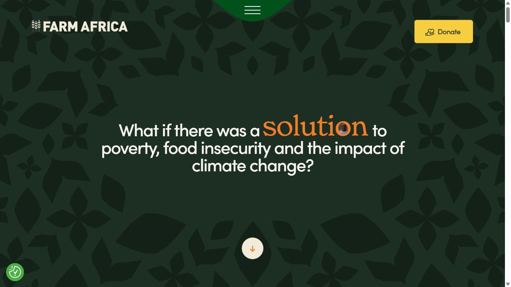

Farm Africa uses a continuous dark green field covered with large, irregular, low-contrast leaf silhouettes. The greenery runs across all edges while leaving a quiet center. The question is compact, in a narrow central measure, with one orange word and a single scroll cue. Its logo, menu, and Donate control are clear but secondary.

Caywood Brown's background combines leaf forms with gray circular blobs and a vignette. The shapes read as separate objects instead of a connected canopy. The large animated question, top badge, scroll cue, and fixed controls crowd the first-screen hierarchy. In this capture, the headline and badge never appeared; the headline's computed opacity was still 0 after repeated checks. Remove the circular layer, use a full-width leafy background with a calm center, keep the question within a smaller text measure, and make the heading visible without depending on animation.

## 2. Scroll transition and mission reveal — Caywood Brown: major

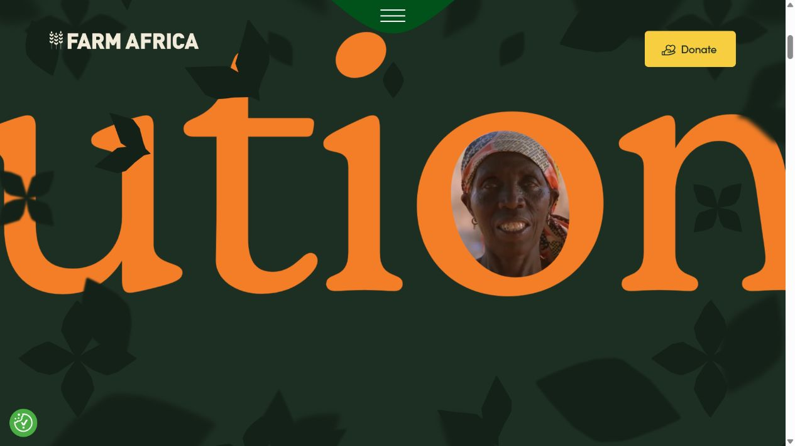
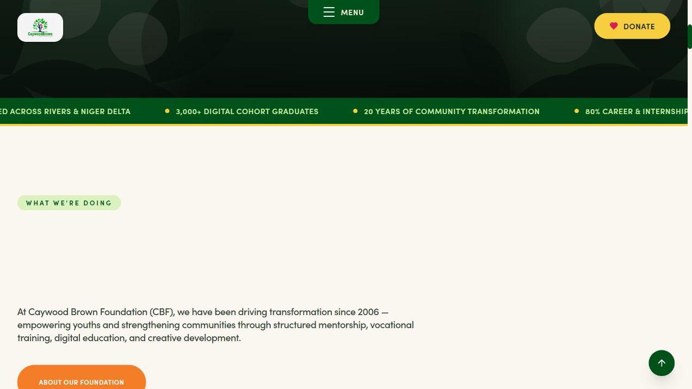

Farm Africa turns the highlighted word into a cinematic bridge: oversized orange lettering contains moving portraits, then the person fills the screen and the site reveals its mission against an airy sky-like backdrop with colored botanical motifs. The transition links the question to real people and then to the answer.

Caywood Brown rotates abstract answer words on a timer and follows the hero with a moving statistics strip, cream section, badge, long mission copy, photo card, and a large evidence box. These are individual effects rather than one narrative transition. The cream mission heading was also invisible in this browser capture. Keep one answer, shorten the mission paragraph, and use a single deliberate visual bridge from question to programme imagery.

## 3. Giving section — Caywood Brown: major

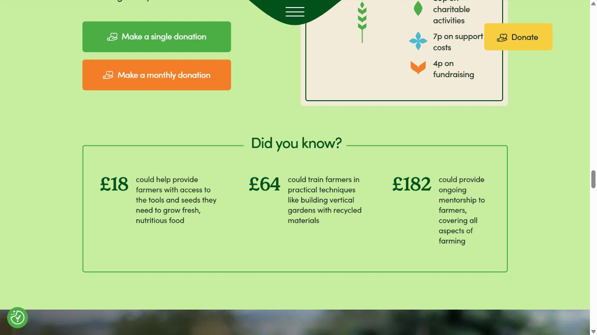
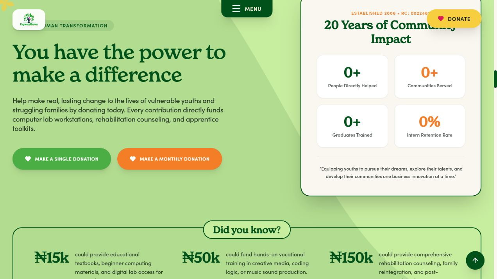

Both sites use a mint-green band, single/monthly actions, and a bordered giving example. Farm Africa balances a short appeal against a spending breakdown and generous negative space. The examples are easy to scan because amount and result each have clear roles.

Caywood Brown adds a large four-card impact panel, a quote, eyebrow labels, the three giving examples, a patterned backdrop, and two CTAs. The panel competes with the donation action; its counters showed 0 in this browser. The fixed Donate control also overlaps the panel title. The homepage's `#single` and `#monthly` links do not correspond to anchors on the donation page (`#donate-now` and `#monthly-giving` are present). The donation page simulates success with a timeout rather than a payment result, while displaying secure-payment claims and a sample bank account number. Simplify the band, correct the anchors, and remove payment-success claims until real processing is connected.

## 4. Programme rows — Caywood Brown: moderate

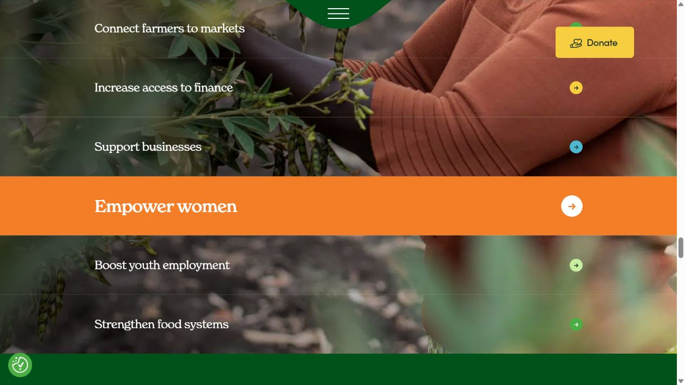
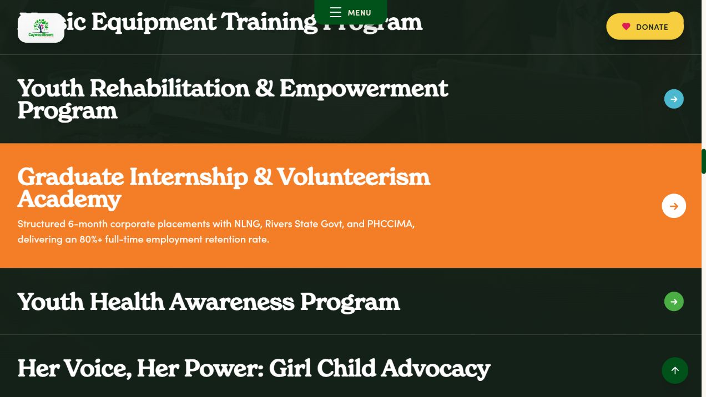

Farm Africa labels outcomes in short phrases such as “Empower women” and “Boost youth employment.” Large photographic rows and one bright hover state let the visitor scan quickly. Caywood Brown uses lengthy formal programme names, two-line row headings, and longer descriptions on hover. The underlying images are very dark, so the rows often look like flat black bands. Use short outcome labels in the row and place full official programme titles on detail pages; brighten imagery enough to be identifiable.

## 5. News and stories — Caywood Brown: major

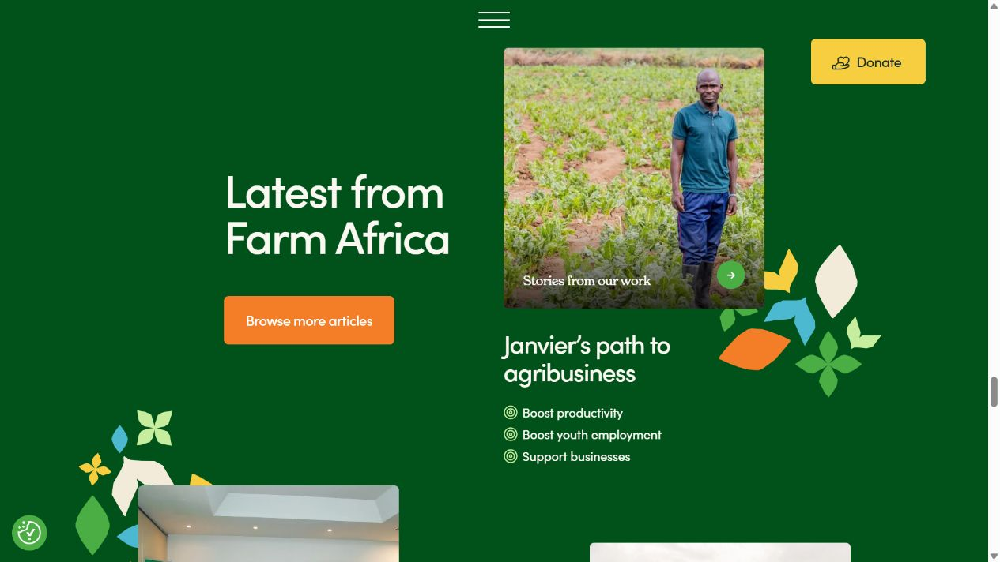

Farm Africa uses an asymmetric editorial arrangement with photographs of the work, sparse colored foliage motifs, a short title, and concise category tags. Caywood Brown's story cards are more uniform and copy-heavy. Several image/subject pairings are weak: a generic world map accompanies a Port Harcourt keyboard-and-drum camp, and stock health imagery accompanies the immunization story. One homepage card sends visitors to the general events page rather than its own story. Use actual event images and direct links to the matching article or event.

## 6. Testimonial — Caywood Brown: major

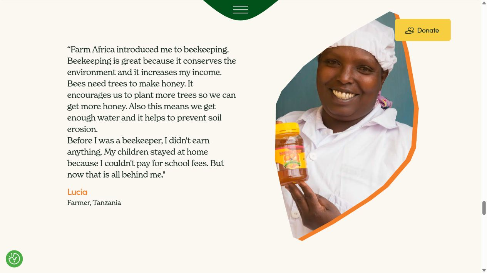

Farm Africa gives Lucia's quote a quiet cream page, restrained serif type, her name/location, and a large photograph of Lucia framed in an organic shape. Caywood Brown has a similar split composition, but the quote is larger and italicized throughout, while the photo appears to be a generic office portrait and is cropped so the face is not visible. This weakens the connection between named speaker and image. Verify the quote and use the speaker's own portrait; if unavailable, omit the portrait rather than implying it shows that person. The local testimonial was inspected on screen, but its saved screenshot was misframed and excluded from this evidence set.

## 7. Impact proof — Caywood Brown: major

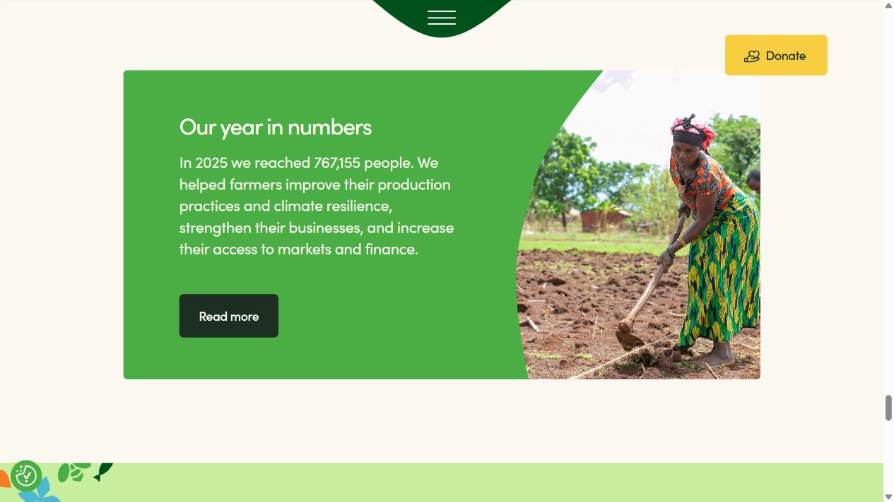
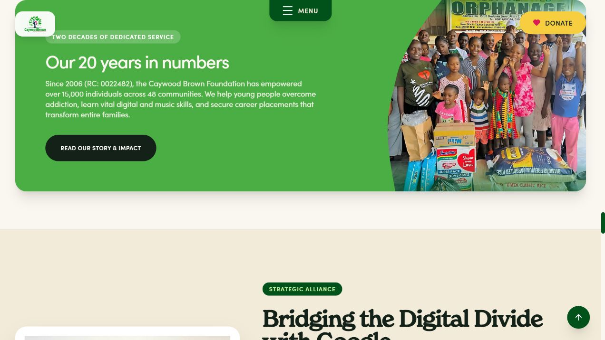

Farm Africa gives a dated 2025 reach figure, a short account of what changed, a linked detail page, and a photograph that shows the same subject as its mission. Its annual review and financial statements are public: https://www.farmafrica.org/publications/annual-reviews/ . Caywood Brown's card follows the same masked green-photo shape, but combines a 20-year total with multiple outcomes and an orphanage photo that does not directly show the digital and career programmes described. Elsewhere the homepage says 3,000+ digital graduates while the donation panel says 489+ graduates trained; the 80% figure also changes meaning between placement and retention. Reconcile metrics, give them a date and source, and use a photo matched to the claim.

## 8. Closing paths and newsletter — Caywood Brown: moderate

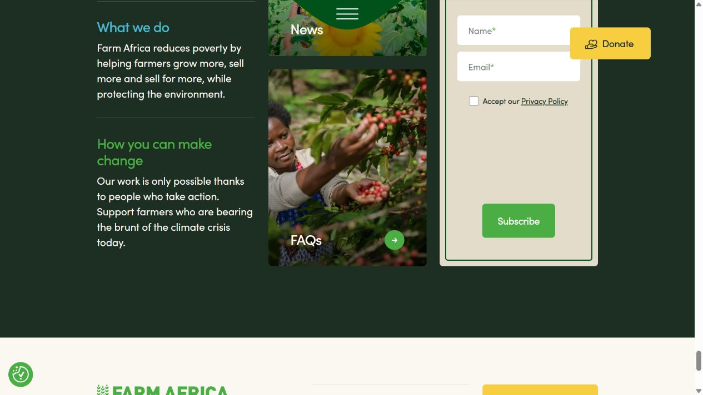
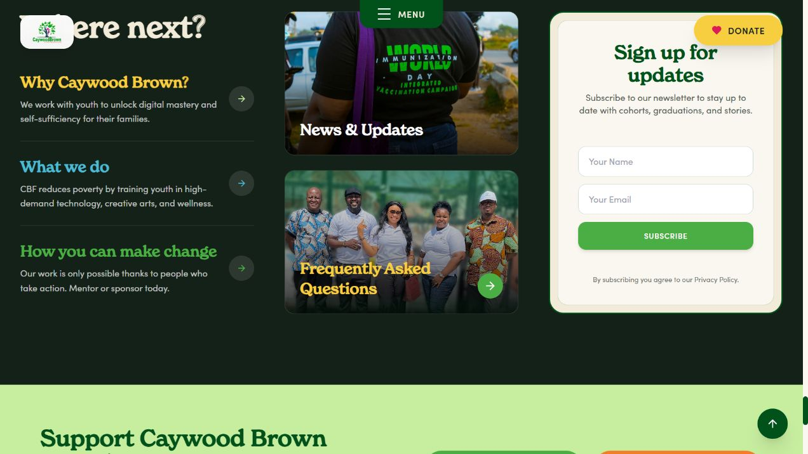

The three-column close is similar on both sites. Farm Africa's newsletter has explicit name/email labels, a privacy-consent control, and a working policy link. Caywood Brown's form has placeholders and a Subscribe button but no submission handler. The footer links to `/privacy-policy` and `/terms`, but neither route exists in the repository. Social icons point to `#`. The visual close is competent; the missing behavior and links reduce confidence.

## 9. Mobile first screen — Caywood Brown: critical

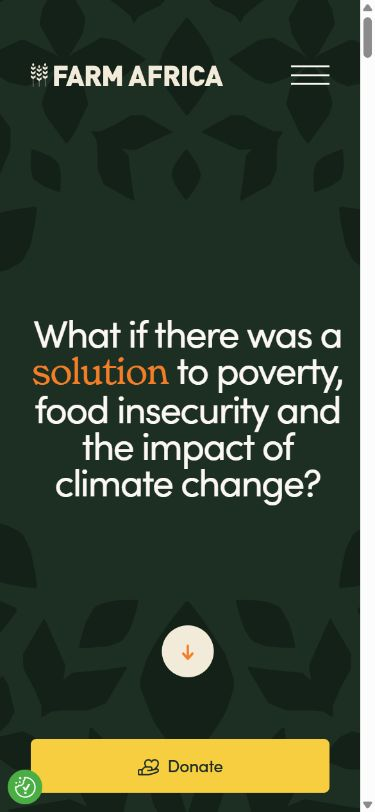
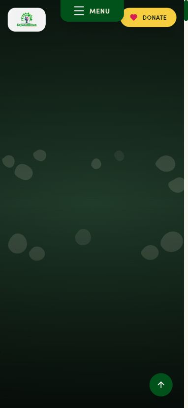

At 390 × 844, Farm Africa retains a readable question and leaf canopy, places logo/menu at the top, and moves Donate into a wide bottom action. Caywood Brown keeps logo/menu/Donate across the top, leaving cramped controls. Its question and scroll cue were invisible in this capture; the headline again had computed opacity 0. The remaining circular shapes do not stretch as a botanical canopy. A static visible heading and separate mobile control arrangement are the highest-priority responsive fixes.

## Motion and accessibility notes

Farm Africa's large portrait transition is visually strong but should be tested for reduced-motion behavior and keyboard/assistive-technology access; screenshots alone cannot establish compliance. Caywood Brown's timed word rotation, bouncing scroll cue, moving statistics strip, and animated counters create more simultaneous movement. The invisible heading/zero-counter states were confirmed in this browser but need reproduction in another browser and device before assigning the exact root cause. Hover-only programme explanations, text over dark photography, fixed controls covering headings, placeholder-only newsletter fields, and broken policy links are accessibility and usability risks.

## Recommended order

1. Make all headings and figures visible before animation; retest desktop and mobile.
2. Edit the hero: connected edge-to-edge leafy canopy, calm center, compact static headline, and uncluttered mobile controls.
3. Reduce moving and repeated labels; turn the question-to-mission passage into one purposeful transition.
4. Replace generic imagery with real programme, event, and beneficiary photos tied to their copy.
5. Reconcile, date, and source impact claims, then link to an impact/report page.
6. Fix donation anchors and real payment behavior, newsletter submission, privacy/terms routes, social links, and individual story destinations.

Evidence limits: the payment flow was read from source and was not used to enter payment data. The browser's viewport override captured the two first screens at mobile size, but the full mobile page was not traversed. No automated contrast, keyboard, screen-reader, or reduced-motion audit was run.
